# iOS Startup Guide

This is a startup guide for an iOS project covering how to use `.xcconfig` files to store `Xcode` configuration settings, and through them any configuration specific variables, ie settings for Debug / Release or Dev / Test / Stage / Prod.

## Table of Contents
- [Overview](#overview)
- [Using xcconfig files](#using-xcconfig-files)
    - [Create xcconfig files](#create-xcconfig-files)
- [References](#references)
    - [References to using xcconfig files](#references-to-using-xcconfig-files)
    - [Sharing Xcode schemes](#sharing-xcode-schemes)
    - [Guide to xcconfig files](#guide-to-xcconfig-files)
    - [Generally good iOS practices](#generally-good-ios-practices)

## Overview
This guide covers setting up `.xcconfig` files as a place to store `Project` and `Target` settings. This enables us to create different builds using different project `schemes` and `configurations`. The end goal is a code base that is the same for Dev, Test, Stage, and Prod environments, though you can choose to have as many configurations as you want. This allows for settings, for example a server URL in Dev / Test / Stage / Prod, to be stored within the `.xcconfig` files. Doing this also makes working with project / target changes much easier to manage in configuration management, ie `git`.

## Using xcconfig files
As mentioned in the overview, `.xcconfig` files allow us to put the `Project` and `Target` settings there and move them out of the `project.pbxproj` file. This makes for much better configuration management as the `project.pbxproj` file can be arcane and difficult to read, and hence difficult to diff/merge. Since `Project` and `Target` settings will override `.xcconfig` files, it also allows us to test settings out in the project settings, and easily revert them, before committing them to the `.xcconfig` files.

Let's get started!

#### Create xcconfig files
These are the general steps to create the `xcconfig` files. The commits for this can be easily identified in the git log and are all labeled **ios-setup**.

For this tutorial we used `Objective-C`, but the steps will be the same for `Swift`.

1. Create a `.gitignore` and add in GitHub's [gitignore](https://github.com/github/gitignore) for [Objective-C](https://github.com/github/gitignore/blob/master/Objective-C.gitignore), [Swift](https://github.com/github/gitignore/blob/master/Swift.gitignore), and [Xcode](https://github.com/github/gitignore/blob/master/Global/Xcode.gitignore)
2. Create a new `iOS` project
    - Create a `Single View App` called **iOS Startup Guide** and select **Objective-C** as the language
    - Set the Project Format to **Xcode 10.0-compatible**
    - Set the Class Prefix to **Startup**
    - 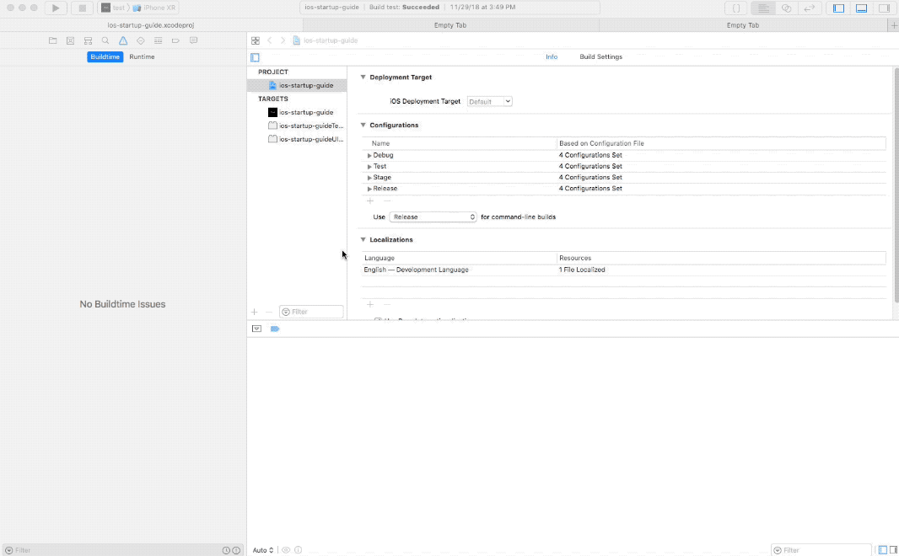
3. Create the Debug, Test, Stage, and Release schemes
    - Rename the existing scheme to Debug
    - Create a new scheme and name it Test
    - Create a new scheme and name it Stage
    - Create a new scheme and Name it Release
    - 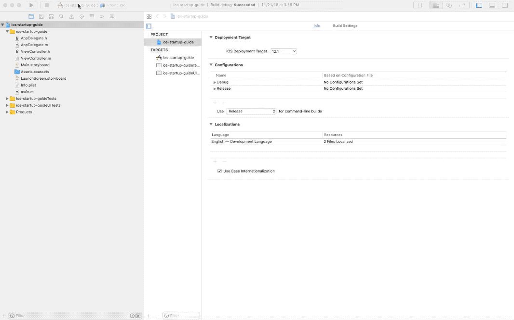
4. Create the Project Configurations
    - Duplicate the **Debug** configuration and rename it 'Test'
    - Rename the **Release** scheme to 'Stage'
    - Duplicate the **Stage** scheme and rename it 'Release'
    - Set **Use 'Release' for command-line builds** to **Release** (it will have been set to **Stage**)
    - 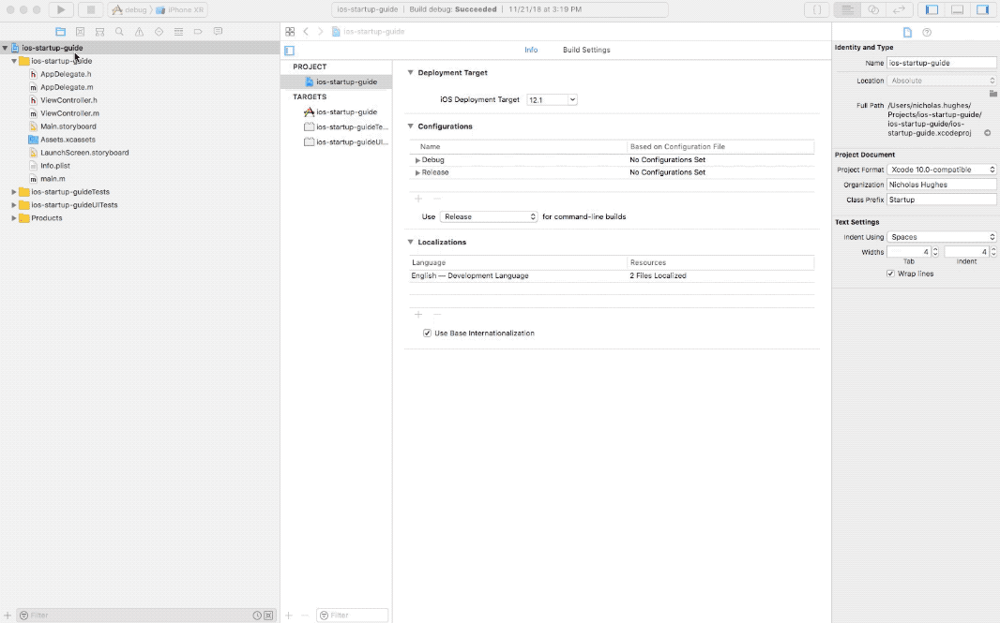
5. Modify the Project Configurations
    - Modify **Debug**
        - Set the ios-startup-guide project to use the **Global**
        - Set the ios-startup-guide target to use **Debug**
    - Modify **Test**
        - Set the ios-startup-guide project to use the **Global**
        - Set the ios-startup-guide target to use **Test**
    - Modify **Stage**
        - Set the ios-startup-guide project to use the **Global**
        - Set the ios-startup-guide target to use **Stage**
    - Modify **Release**
        - Set the ios-startup-guide project to use the **Global**
        - Set the ios-startup-guide target to use **Release**
    - 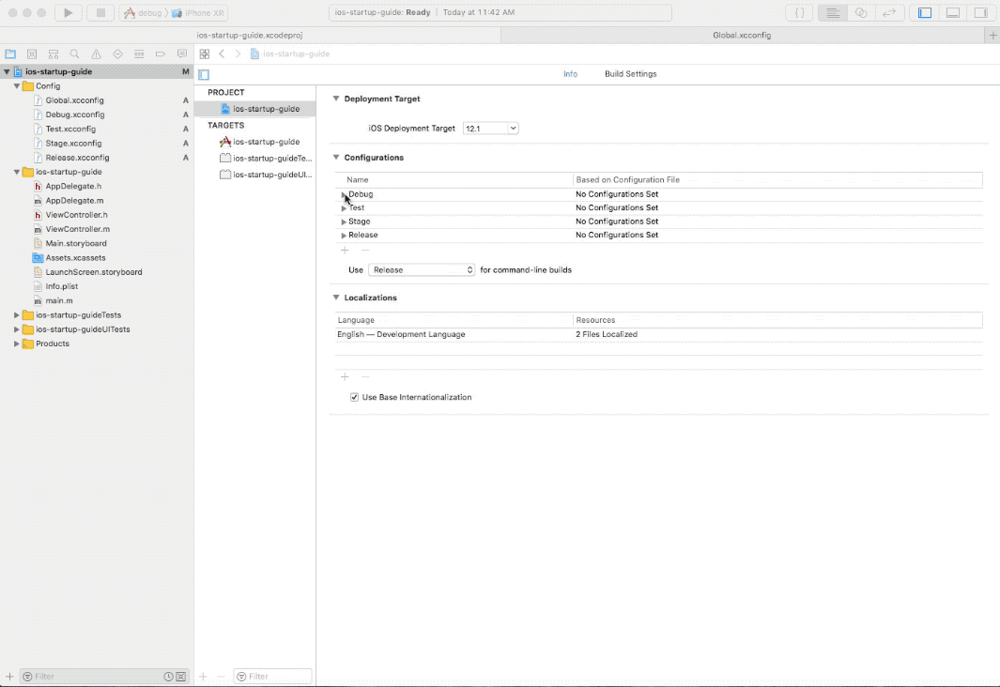
6. Modify the schemes
    - Edit the **Debug** project scheme and choose 'Debug' where possible in the **Build**, **Run**, **Test**, **Profile**, **Analyze**, and **Archive** settings
    - Edit the **Test** project scheme and choose 'Test' where possible in the **Build**, **Run**, **Test**, **Profile**, **Analyze**, and **Archive** settings
    - Edit the **Stage** project scheme and choose 'Stage' where possible in the **Build**, **Run**, **Test**, **Profile**, **Analyze**, and **Archive** settings
    - Edit the **Release** project scheme and choose 'Release' where possible in the **Build**, **Run**, **Test**, **Profile**, **Analyze**, and **Archive** settings
    - 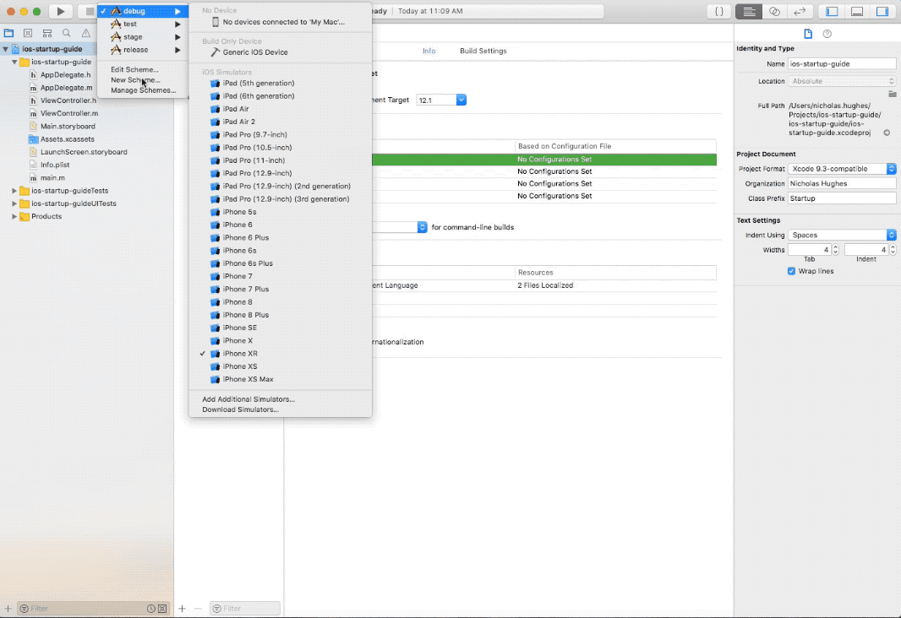
7. Create a **Config** Group
    - Right click on the Project and create a Group called 'Config'
    - 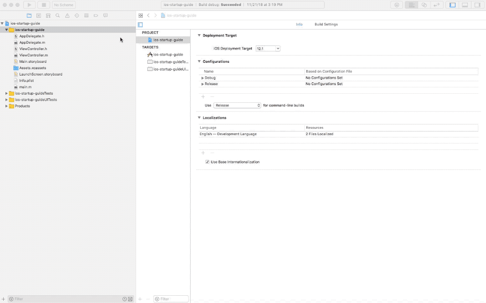
8. Create the .xcconfig files
    - Right click on the 'Config' group, select **New File...**, choose **Configuration Settings File**, and name it **Global.xcconfig**
    - Right click on the 'Config' group, select **New File...**, choose **Configuration Settings File**, and name it **Debug.xcconfig**
    - Right click on the 'Config' group, select **New File...**, choose **Configuration Settings File**, and name it **Test.xcconfig**
    - Right click on the 'Config' group, select **New File...**, choose **Configuration Settings File**, and name it **Stage.xcconfig**
    - Right click on the 'Config' group, select **New File...**, choose **Configuration Settings File**, and name it **Release.xcconfig**
    - 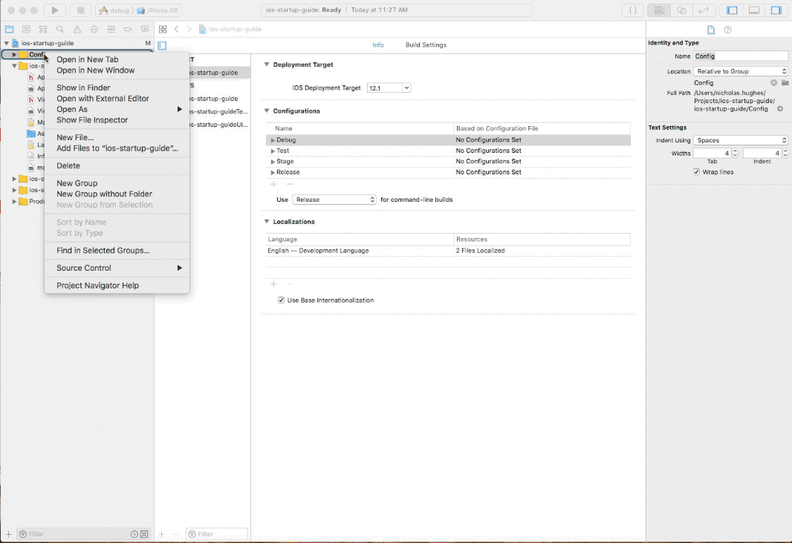
9. Copy the Project settings into the xcconfig files
    - Click on the Project and select **Build Settings**. Make sure that **All** and **Levels** is selected.
    - Scroll down and check for entries that are in **bold** under the project column. These entries are different from the default and should be copied into the xcconfig files.
        - If there is a value under the **iOS Default column**, expand it and see if it is the same for all entries. If so, it should be placed in Global.xcconfig. If they differ they should be placed into their respective xcconfig file, ie Debug to Debug.xcconfig.
    - 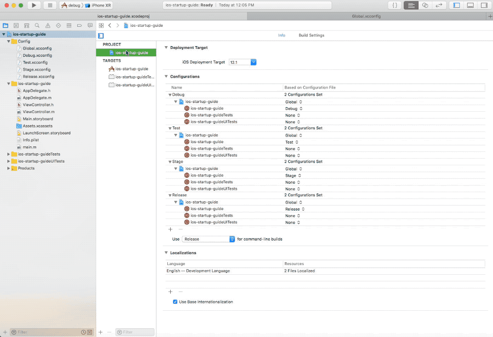
10. Delete the project settings
    - Now that the project settings are in the Global, Debug, Test, Stage, and Release xcconfig files, delete the values from the project column.
    - 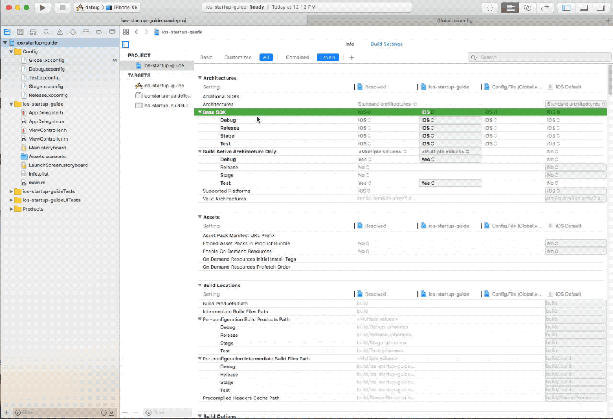
11. Copy the Target settings into the xcconfig files
    - Click on the Targets, select the project, and select **Build Settings**. Make sure that **All** and **Levels** is selected.
    - Scroll down and check for entries that are in **bold** under the target column. These entries are different from the default and should be copied into the xcconfig files.
        - Expand the entry and check to see which entries are bold. These should be copied into the xcconfig files. For example, if all entries are bold then all xcconfig files should have an entry. If just a particular entry is bold, then only that entry should be placed into an xcconfig file.
    - In the end, the Debug.xcconfig and Test.xcconfig should be the same and the Stage.xcconfig and Release.xcconfig should be the same.
12. Delete the target settings
    - Now that the target settings are in the Debug, Test, Stage, and Release xcconfig files, delete the values from the target column.
    - 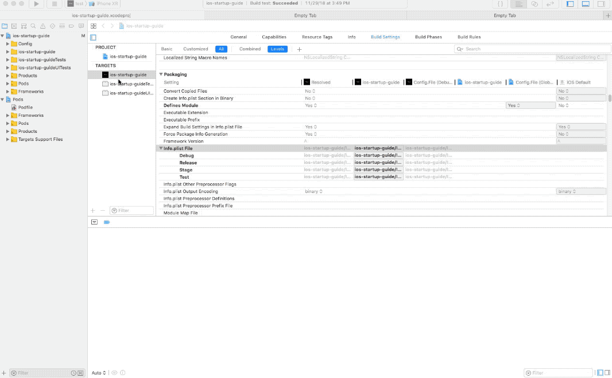
13. Change the 'product bundle identifier' in the xcconfig files
    - This creates the separate builds.
        - Append .dev to the Debug.xcconfig **PRODUCT_BUNDLE_IDENTIFIER** entry.
        - Append .test to the Test.xcconfig **PRODUCT_BUNDLE_IDENTIFIER** entry.
        - Append .stage to the Stage.xcconfig **PRODUCT_BUNDLE_IDENTIFIER** entry.
        - Do not append anything to the Release.xcconfig entry; this is our prod environment.
        - 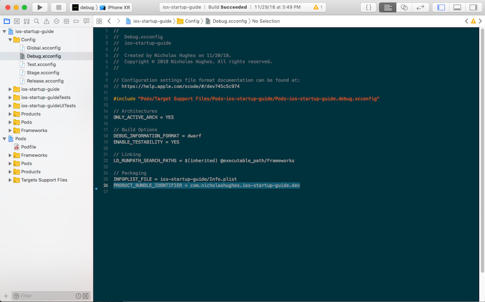
14. Change the 'product name'
    - Append -Dev to the Debug.xcconfig **PRODUCT_NAME** entry.
    - Append -Test to the Test.xcconfig **PRODUCT_NAME** entry.
    - Append -Stage to the Stage.xcconfig **PRODUCT_NAME** entry.
    - Do not append anything to the Release.xcconfig entry; this is our prod environment.
    - 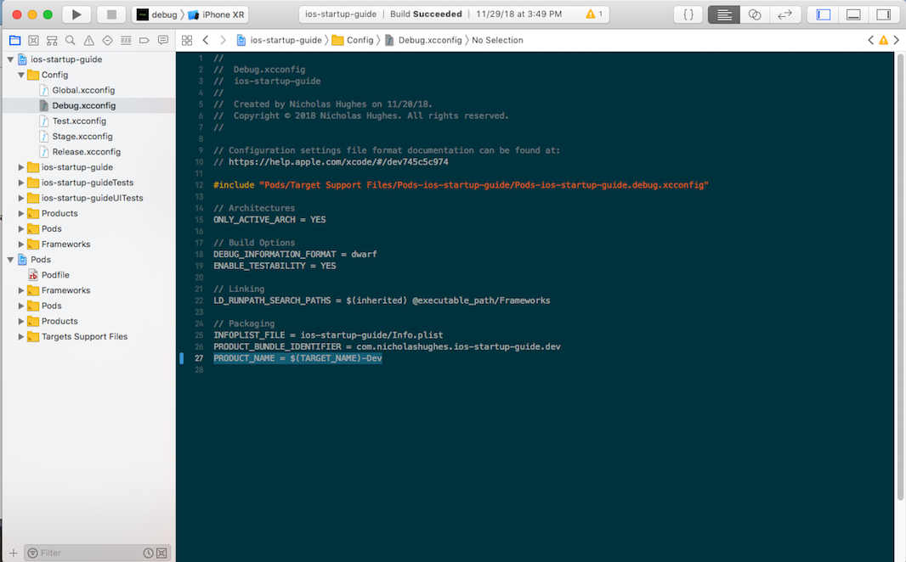
15. Create an AppIcon set for Dev, Test, and Stage
    - Select the Assets.xcassets, right-click in the area where the AppIcon entry is, select App Icons & Launch Images, and select new iOS App Icon.
        - Create an AppIconDev entry
        - Create an AppIconTest entry
        - Create an AppIconStage entry
        - 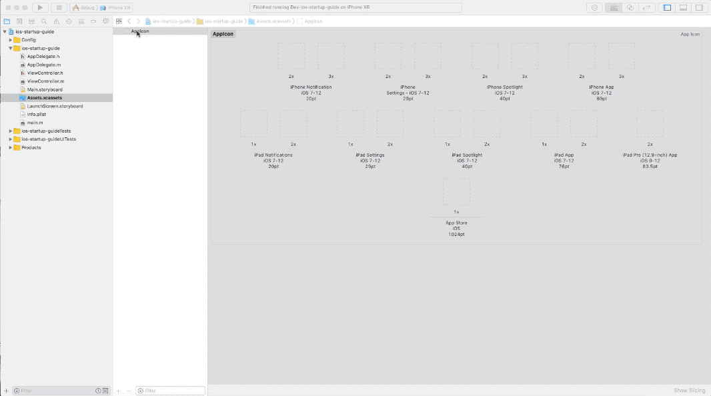
    - Drag over the images from the **resources/images/appicons** directory
        - Copy the Dev icons into the the AppIconDev entries
        - Copy the Test icons into the the AppIconTest entries
        - Copy the Stage icons into the the AppIconStage entries
        - Copy the Prod icons into the the AppIcon entries
        - 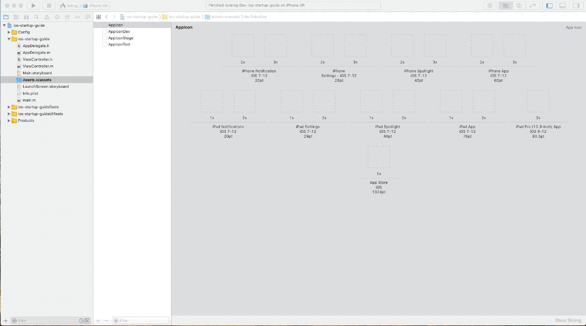
16. Update the App Icon settings in the xcconfig files
    - Change the xcconfig files to use the configuration-specific app icon
        - In Debug.xcconfig, change the **ASSETCATALOG_COMPILER_APPICON_NAME** to be AppIconDev
        - In Test.xcconfig, change the **ASSETCATALOG_COMPILER_APPICON_NAME** to be AppIconTest
        - In Stage.xcconfig, change the **ASSETCATALOG_COMPILER_APPICON_NAME** to be AppIconStage
        - No need for changes in the Release.xcconfig
        - 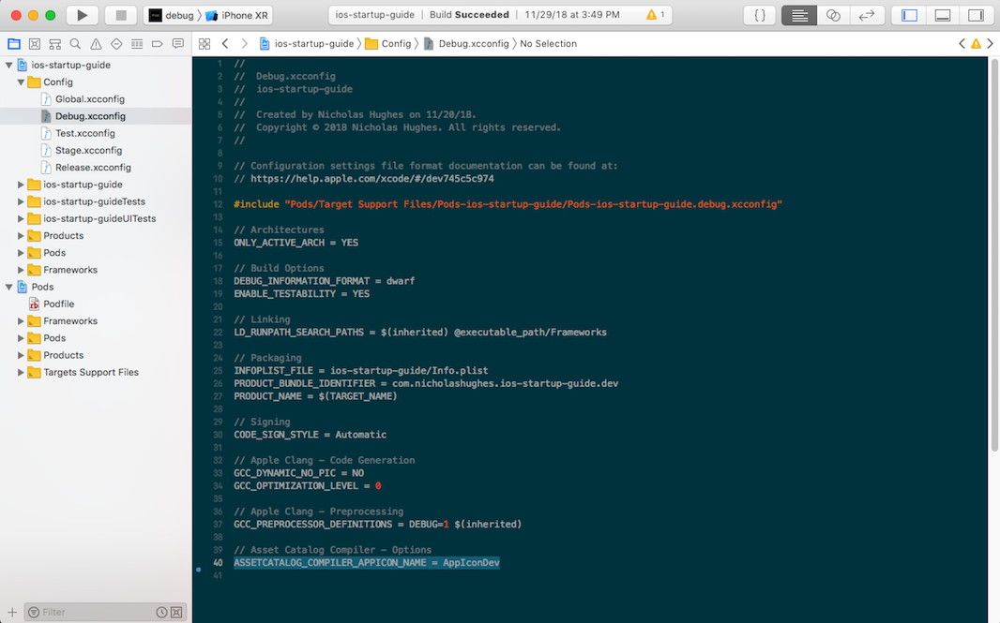

Now change the scheme and built the project. Do this for all schemes: Debug, Test, Stage, and Release. We will have four separate and easily identifiable project builds.

## References
Here is a list of articles I read that cover these topics. I was motivated me to condense them all into one place, hence I wrote this tutorial.

#### References to using xcconfig files
These cover how to setup the different xcconfig files, including different configuration environments, using different App Icons, and setting up CocoaPods.

- http://www.jontolof.com/cocoa/using-xcconfig-files-for-you-xcode-project/
- https://www.appcoda.com/xcconfig-guide/
- https://hackernoon.com/a-cleaner-way-to-organize-your-ios-debug-development-and-release-distributions-6b5eb6a48356

#### Sharing Xcode schemes
This covers why the schemes were 'shared' and why they need to be shared in a team setting.

- http://nsbogan.com/xcode/2014/05/29/share-xcode-schemes

#### Guide to xcconfig files
This covers the usage of `xcconfig` files in more detail, including topics like variable overriding, conditional variables, build setting inheritance, etc.

- https://pewpewthespells.com/blog/xcconfig_guide.html
#### Generally good iOS practices
Covers a good range of iOS topics, such as the pros and cons to using storyboards, dependency management, project structure, etc - all of which were used in this example project.

- https://github.com/futurice/ios-good-practices
