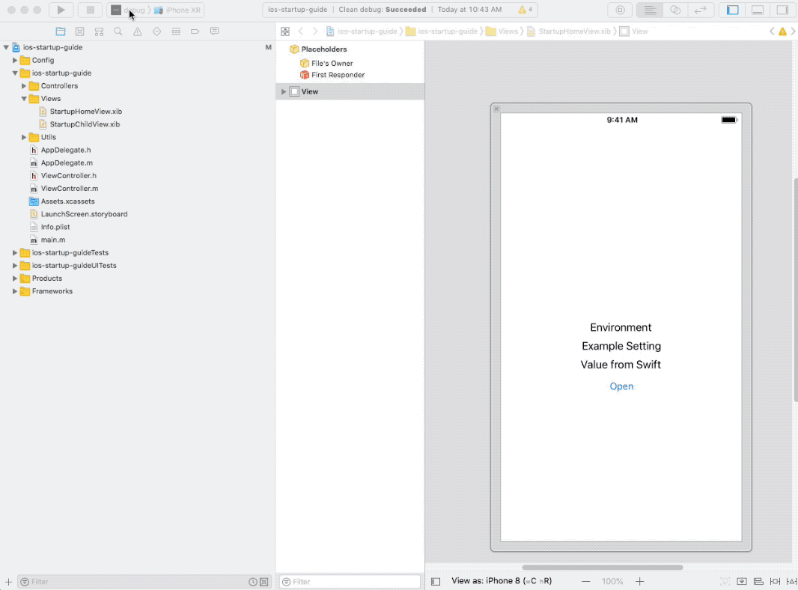
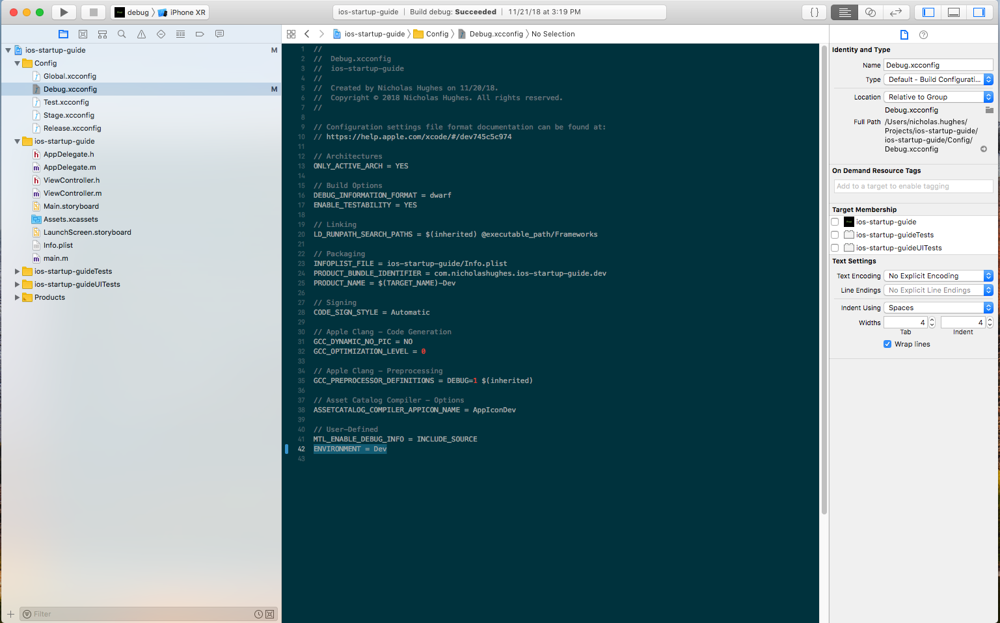
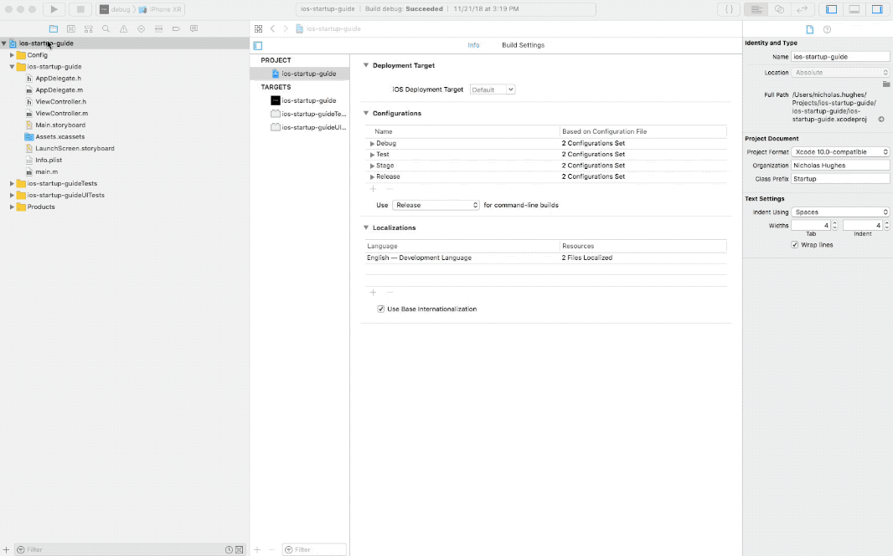
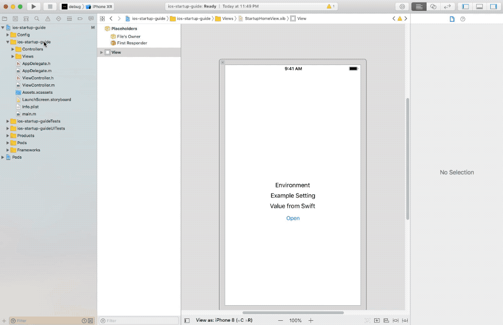
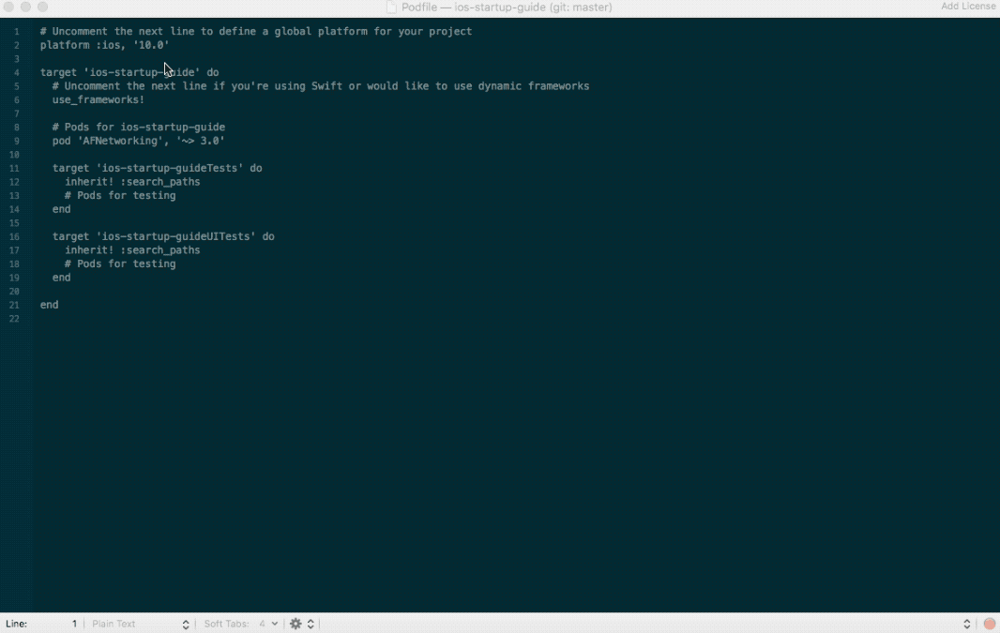

# iOS Startup Guide

This is a startup guide for an iOS project covering how to use `.xcconfig` files to store `Xcode` configuration settings, and through them any configuration specific variables, ie settings for Debug / Release or Dev / Test / Stage / Prod.

This guide also covers other topics and serves as a place to store examples of how to do them.

## Table of Contents
- [Overview](#overview)
- [Setup](#setup)
- [Using xcconfig files](#using-xcconfig-files)
    - [Create xcconfig files](#create-xcconfig-files)
    - [Storing variables in plist](#storing-variables-in-plist)
    - [Storing variables in code](#storing-variables-in-code)
    - [Support for CocoaPods](#support-for-cocoapods)
    - [Support for Swift Bridging](#support-for-swift-bridging)
- [Other topics](#other-topics)
    - [Removing storyboards](#removing-storyboards)
- [References](#references)
    - [References to using xcconfig files](#references-to-using-xcconfig-files)
    - [Sharing Xcode schemes](#sharing-xcode-schemes)
    - [Guide to xcconfig files](#guide-to-xcconfig-files)
    - [Committing CocoaPod files](#committing-cocoapod-files)
    - [Bridging Swift into an Objective-C project](#bridging-swift-into-an-objective-c-project)
    - [Generally good iOS practices](#generally-good-ios-practices)

## Overview
This guide covers setting up `.xcconfig` files as a place to store `Project` and `Target` settings. This enables us to create different builds using different project `schemes` and `configurations`. The end goal is a code base that is the same for Dev, Test, Stage, and Prod environments, though you can choose to have as many configurations as you want. This allows for settings, for example a server URL in Dev / Test / Stage / Prod, to be stored within the `.xcconfig` files. Doing this also makes working with project / target changes much easier to manage in configuration management, ie `git`.

It will also cover setting up `CocoaPods` for use in these different environments as well as setting up `Swift` bridging for interoperability with `Objective-C`, both which will involve the `.xcconfig` files.

Under [Other topics](#other-topics), we cover areas that are not related to the use of `.xcconfig` files.

## Setup
To setup this project, follow the steps below.

1. Clone this repository
2. Install the `Podfile`
    - `cd` to `ios-startup-guide/ios-startup-guide/`
    - Run `pod install`
3. Start `Xcode` and select the `ios-startup-guide.xcworkspace`, located at `ios-startup-guide/ios-startup-guide/ios-startup-guide.xcworkspace`
4. Select each scheme and build it
    - 

This will create four versions of the `ios-startup-guide` app, with the `dev`, `test`, `stage`, and `prod` settings.

## Using xcconfig files
As mentioned in the overview, `.xcconfig` files allow us to put the `Project` and `Target` settings there and move them out of the `project.pbxproj` file. This makes for much better configuration management as the `project.pbxproj` file can be arcane and difficult to read, and hence difficult to diff/merge. Since `Project` and `Target` settings will override `.xcconfig` files, it also allows us to test settings out in the project settings, and easily revert them, before committing them to the `.xcconfig` files.

Let's get started!

#### Create xcconfig files
These are the general steps to create the `xcconfig` files. The commits for this can be easily identified in the git log and are all labeled **ios-setup**.

For this tutorial we used `Objective-C`, but the steps will be the same for `Swift`.

1. Create a `.gitignore` and add in GitHub's [gitignore](https://github.com/github/gitignore) for [Objective-C](https://github.com/github/gitignore/blob/master/Objective-C.gitignore), [Swift](https://github.com/github/gitignore/blob/master/Swift.gitignore), and [Xcode](https://github.com/github/gitignore/blob/master/Global/Xcode.gitignore)
    - I prefer to uncomment the 'Pods/' entry as I don't think it's necessary to check in that directory - my opinion
2. Create a new `iOS` project
    - Create a `Single View App` called **iOS Startup Guide** and select **Objective-C** as the language
    - Set the Project Format to **Xcode 10.0-compatible**
    - Set the Class Prefix to **Startup**
    - 
3. Create the Debug, Test, Stage, and Release schemes
    - Rename the existing scheme to Debug
    - Create a new scheme and name it Test
    - Create a new scheme and name it Stage
    - Create a new scheme and Name it Release
    - 
4. Create the Project Configurations
    - Duplicate the **Debug** configuration and rename it 'Test'
    - Rename the **Release** scheme to 'Stage'
    - Duplicate the **Stage** scheme and rename it 'Release'
    - Set **Use 'Release' for command-line builds** to **Release** (it will have been set to **Stage**)
    - 
5. Modify the Project Configurations
    - Modify **Debug**
        - Set the ios-startup-guide project to use the **Global**
        - Set the ios-startup-guide target to use **Debug**
    - Modify **Test**
        - Set the ios-startup-guide project to use the **Global**
        - Set the ios-startup-guide target to use **Test**
    - Modify **Stage**
        - Set the ios-startup-guide project to use the **Global**
        - Set the ios-startup-guide target to use **Stage**
    - Modify **Release**
        - Set the ios-startup-guide project to use the **Global**
        - Set the ios-startup-guide target to use **Release**
    - 
6. Modify the schemes
    - Edit the **Debug** project scheme and choose 'Debug' where possible in the **Build**, **Run**, **Test**, **Profile**, **Analyze**, and **Archive** settings
    - Edit the **Test** project scheme and choose 'Test' where possible in the **Build**, **Run**, **Test**, **Profile**, **Analyze**, and **Archive** settings
    - Edit the **Stage** project scheme and choose 'Stage' where possible in the **Build**, **Run**, **Test**, **Profile**, **Analyze**, and **Archive** settings
    - Edit the **Release** project scheme and choose 'Release' where possible in the **Build**, **Run**, **Test**, **Profile**, **Analyze**, and **Archive** settings
    - 
7. Create a **Config** Group
    - Right click on the Project and create a Group called 'Config'
    - 
8. Create the .xcconfig files
    - Right click on the 'Config' group, select **New File...**, choose **Configuration Settings File**, and name it **Global.xcconfig**
    - Right click on the 'Config' group, select **New File...**, choose **Configuration Settings File**, and name it **Debug.xcconfig**
    - Right click on the 'Config' group, select **New File...**, choose **Configuration Settings File**, and name it **Test.xcconfig**
    - Right click on the 'Config' group, select **New File...**, choose **Configuration Settings File**, and name it **Stage.xcconfig**
    - Right click on the 'Config' group, select **New File...**, choose **Configuration Settings File**, and name it **Release.xcconfig**
    - 
9. Copy the Project settings into the xcconfig files
    - Click on the Project and select **Build Settings**. Make sure that **All** and **Levels** is selected.
    - Scroll down and check for entries that are in **bold** under the project column. These entries are different from the default and should be copied into the xcconfig files.
        - If there is a value under the **iOS Default column**, expand it and see if it is the same for all entries. If so, it should be placed in Global.xcconfig. If they differ they should be placed into their respective xcconfig file, ie Debug to Debug.xcconfig.
    - 
10. Delete the project settings
    - Now that the project settings are in the Global, Debug, Test, Stage, and Release xcconfig files, delete the values from the project column.
    - 
11. Copy the Target settings into the xcconfig files
    - Click on the Targets, select the project, and select **Build Settings**. Make sure that **All** and **Levels** is selected.
    - Scroll down and check for entries that are in **bold** under the target column. These entries are different from the default and should be copied into the xcconfig files.
        - Expand the entry and check to see which entries are bold. These should be copied into the xcconfig files. For example, if all entries are bold then all xcconfig files should have an entry. If just a particular entry is bold, then only that entry should be placed into an xcconfig file.
    - In the end, the Debug.xcconfig and Test.xcconfig should be the same and the Stage.xcconfig and Release.xcconfig should be the same.
12. Delete the target settings
    - Now that the target settings are in the Debug, Test, Stage, and Release xcconfig files, delete the values from the target column.
    - 
13. Change the 'product bundle identifier' in the xcconfig files
    - This creates the separate builds.
        - Append .dev to the Debug.xcconfig **PRODUCT_BUNDLE_IDENTIFIER** entry.
        - Append .test to the Test.xcconfig **PRODUCT_BUNDLE_IDENTIFIER** entry.
        - Append .stage to the Stage.xcconfig **PRODUCT_BUNDLE_IDENTIFIER** entry.
        - Do not append anything to the Release.xcconfig entry; this is our prod environment.
        - 
14. Change the 'product name'
    - This creates a unique name when building the project. **Note that this will not work with CocoaPods, so do not do this if you are planning on using CocoaPods**; this is purely for aesthetics anyways.
        - Append -Dev to the Debug.xcconfig **PRODUCT_NAME** entry.
        - Append -Test to the Test.xcconfig **PRODUCT_NAME** entry.
        - Append -Stage to the Stage.xcconfig **PRODUCT_NAME** entry.
        - Do not append anything to the Release.xcconfig entry; this is our prod environment.
        - 
15. Create an AppIcon set for Dev, Test, and Stage
    - Select the Assets.xcassets, right-click in the area where the AppIcon entry is, select App Icons & Launch Images, and select new iOS App Icon.
        - Create an AppIconDev entry
        - Create an AppIconTest entry
        - Create an AppIconStage entry
        - 
    - Drag over the images from the **resources/images/appicons** directory
        - Copy the Dev icons into the the AppIconDev entries
        - Copy the Test icons into the the AppIconTest entries
        - Copy the Stage icons into the the AppIconStage entries
        - Copy the Prod icons into the the AppIcon entries
        - 
16. Update the App Icon settings in the xcconfig files
    - Change the xcconfig files to use the configuration-specific app icon
        - In Debug.xcconfig, change the **ASSETCATALOG_COMPILER_APPICON_NAME** to be AppIconDev
        - In Test.xcconfig, change the **ASSETCATALOG_COMPILER_APPICON_NAME** to be AppIconTest
        - In Stage.xcconfig, change the **ASSETCATALOG_COMPILER_APPICON_NAME** to be AppIconStage
        - No need for changes in the Release.xcconfig
        - 

Now change the scheme and built the project. Do this for all schemes: Debug, Test, Stage, and Release. We will have four separate and easily identifiable project builds.

#### Storing variables in plist
Storing variables in plist will allow for configuration specific variables, rather than requiring multiple entries in a plist with different key names or having to use multiple plist files. The commits for this can be easily identified in the git log and are all labeled **plist-example**. The commits cover adding a label to the `Main.storyboard` and populating the label text with the value from the plist.

1. Create an ENVIRONMENT entry under the User-Defined section of the xcconfig files
    - Scroll to the bottom of the Debug.xcconfig, Test.xcconfig, Stage.xcconfig, and Release.xcconfig files
    - Under User-Defined create an entry called ENVIRONMENT
        - In Debug.xcconfig, set it to Dev
        - In Test.xcconfig, set it to Test
        - In Stage.xcconfig, set it to Stage
        - In Release.xcconfig, set it to Prod
    - 
2. Open Info.plist and create a dictionary entry called 'Project settings'
    - Right click on the Information Property List and create an entry of type of Dictionary. It is better to keep all our values that we add under one entry, in effect name spacing them, rather than littering the plist file with arbitrary entries
    - Right click on the 'Project settings' and create an entry of type String. Set it to be $(ENVIRONMENT), and this will tell the plist file that the value will be determined from the xcconfig file
    - 

If you have downloaded the code, and you switch between the schemes, you can see that each different build shows its environment value in the environment label.

#### Storing variables in code
An alternative approach to storing multiple environment specific values in the plist would be to just store the **ENVIRONMENT** variable, as outlined above, and then create a class in which to retrieve values specific to each environment. The commits for this can be easily identified in the git log and are all labeled **settings-file**. The commits cover adding a label to the `Main.storyboard` and populating the label text with the value from the **exampleSetting** function provided through the `StartupProjectSettingsUtils.h`.

1. Create a 'Utils' group under the target entry
    - Right-click on the 'ios-startup-guide' entry and create a group called 'Utils'. This group should be at the same level as the AppDelegate entries and NOT at the same level as the 'Config' group.
2. Create a new set of Objective-C files called StartupProjectSettingsUtils
    - Create both the StartupProjectSettingsUtils, the .m and .h
        - Right-click on the 'Utils' group and add a new Objective-C file called StartupProjectSettingsUtils.m
        - Add a function called **exampleSetting** that will retrieve a value based on the ENVIRONMENT plist value
        - Right-click on the 'Utils' group and add a new Header file called StartupProjectSettingsUtils.h
        - Add interface to the **exampleSetting** function so that it can be called publicly

The pros to storing configuration settings in this manner, rather than through the plist, is that everything is code based. This reduces the probability of the plist file being filled with junk entries, and this is perhaps easier to understand for people new to Xcode development. The downside to this approach would be that each new value to retrieve would require several lines of code to check the value of the current environment.

#### Support for CocoaPods
CocoaPods is an application dependency manager for Objective-C and Swift projects. This allows us to easily install a specific version of a third-party tool, such as `AFNetworking`. Using CocoaPods requires the location of the Pods xcconfig files be added to the project, which as we know by now, means adding it to our project's `xcconfig` files.

The commits for this can be easily identified in the git log and are all labeled **cocapods**.

##### Installing CocoaPods onto your system
1. Run 'sudo gem install cocoapods'
2. Run 'pod setup --verbose'
3. cd to the location of your project file, ie wherever the .xcodeproj file is located
4. Run 'pod init'
5. Edit the Podfile
    - Uncomment and set the platform
    - Uncomment 'use_frameworks!' and add any frameworks, such as AFNetworking
    - 

##### Installing Pods into your project
1. If CocoaPods was already installed
    - Delete the .xcworkspace file (rm -rf .xcworkspace)
    - Delete the Podfile.lock file
    - Delete the Pods/ directory
2. Run 'pod install' in the terminal
3. CocoaPods will state that it 'did not set the base configuration of your project because your project already has a custom config set'
4. Follow the CocoaPods instructions to add the correct line to the xcconfig files
    - In Debug.xcconfig, add #include "Pods/Target Support Files/Pods-ios-startup-guide/Pods-ios-startup-guide.debug.xcconfig"
    - In Test.xcconfig, add #include "Pods/Target Support Files/Pods-ios-startup-guide/Pods-ios-startup-guide.test.xcconfig"
    - In Stage.xcconfig, add #include "Pods/Target Support Files/Pods-ios-startup-guide/Pods-ios-startup-guide.stage.xcconfig"
    - In Release.xcconfig, add #include "Pods/Target Support Files/Pods-ios-startup-guide/Pods-ios-startup-guide.release.xcconfig"

#### Support for Swift Bridging
As more developers begin to use Swift, it is worthwhile to see how to incorporate Swift into an Objective-C project. This provides a means to slowly update a legacy project or allow developers who don't know Objective-C to work on a primarily Objective-C based project.

The commits for this can be easily identified in the git log and are all labeled **swift-bridging**.

1. Create a Swift file through the Xcode interface
    - When prompted whether to add an Objective-C bridging Header, choose 'Yes'
        - This will create the ios-startup-guide-Bridging-Header.h file, where the name comes from the project name
2. For Swift bridging to work, 'DEFINES_MODULE' must be set to 'YES' in the project settings
    - Open Global.xcconfig and add DEFINES_MODULE = YES
3. Move the Swift project settings to the xcconfig files
    - Move the Debug and Test settings into Debug.xcconfig and Test.xcconfig
    - Move the Stage and Release settings into Stage.xcconfig and Release.xcconfig
    - Remove the entries from the actual project settings
4. Make sure the 'Product Name' is the same across all xcconfig files
    - The header file to import the Swift code is auto-generated based off the 'Product Name', thus if they are different for each environment, the build process will not find the correct header when the scheme is changed from Debug to Test. A series of #IFDEF statements might work, but it is easier if 'Product Name' is simply the same across all builds.
5. Create an example Swift class with an example function
    - Be sure that the Swift class and function both have a '@objc' at the beginning; without the '@objc', Objective-C will not be able to call the class or function
6. Modify an Objective-C .m file
    - Import the Swift header file, 'ios_startup_guide-Swift.h'
    - Call the Swift class and function as if it was an Objective-C class and function

## Other topics

#### Removing storyboards
Using storyboards can be nice, as it visually displays how the views are connected, making understanding how the app works fairly easy. The downside to this approach is that version conflicts can be hard to merge due to the XML that underlies a storyboard file. A good write up on this topic exists [here](https://github.com/futurice/ios-good-practices#project-setup).

Legacy iOS projects though, may not even have a storyboard file. To show how a project can work with just `.xib` view files, we remove the `Main.storyboard` and launch from a view file. The commits for this are in a separate branch labeled **remove-storyboards**, found [here](https://bitbucket.org/nicholashughes/ios-startup-guide/branch/remove-storyboards).

Note that the `Launch.storyboard` file should be kept, and if one does not exist, ie on a legacy project, it should be added in. Generally, the `Launch.storyboard` is not going to be heavily modified, even in a team setting. This means it is easy to maintain as there really should not be any diff/merge conflicts. Not having a `Launch.storyboard` is harder to maintain as a `Launch icon` needs to be created and added to the `Assets`. This icon may need to change depending on Apple releasing a new phone size or discontinuing support for a phone size. Also, it may not rotate or fill the view well. Hence adding an empty `Launch.storyboard` is a better solution.

1. Create a new view file, ie an .xib file
2. Create a new view controller file
3. Edit .xib view file in the Interface Builder
    - Set the File's Owner to be the view controller class
    - Connect the view outlet to the File's Owner
4. In the AppDelegate.m, load and display the view controller
    - This will override the Main.storyboard, and now it can be deleted
5. Delete the 'Main storyboard file base name' entry from Info.plist
6. Delete the Main.storyboard file
    - As it is no longer needed, and no longer reference, it can be deleted

## References
Here is a list of articles I read that cover these topics. I was motivated me to condense them all into one place, hence I wrote this tutorial.

#### References to using xcconfig files
These cover how to setup the different xcconfig files, including different configuration environments, using different App Icons, and setting up CocoaPods.

- http://www.jontolof.com/cocoa/using-xcconfig-files-for-you-xcode-project/
- https://www.appcoda.com/xcconfig-guide/
- https://hackernoon.com/a-cleaner-way-to-organize-your-ios-debug-development-and-release-distributions-6b5eb6a48356

#### Sharing Xcode schemes
This covers why the schemes were 'shared' and why they need to be shared in a team setting.

- http://nsbogan.com/xcode/2014/05/29/share-xcode-schemes

#### Guide to xcconfig files
This covers the usage of `xcconfig` files in more detail, including topics like variable overriding, conditional variables, build setting inheritance, etc.

- https://pewpewthespells.com/blog/xcconfig_guide.html

#### Committing CocoaPod files
I was not sure whether or not the `.Podlock` file should be committed when I was first using CocoaPods. This is why you should commit it. Reading the gitignore for Objective-C, Swift, or Xcode also covers whether you want to commit other files, such as the `Pods/` directory, and why you should or should not.

- https://github.com/liftoffcli/liftoff/issues/30

#### Bridging Swift into an Objective-C project
This Stack Overflow question has a series of good answers that cover the steps needed to incorporate Swift in to an Objective-C project and then how to actually import the Swift code into a `.h` or `.m` file.

- https://stackoverflow.com/questions/24102104/how-can-i-import-swift-code-to-objective-c

#### Generally good iOS practices
Covers a good range of iOS topics, such as the pros and cons to using storyboards, dependency management, project structure, etc - all of which were used in this example project.

- https://github.com/futurice/ios-good-practices
